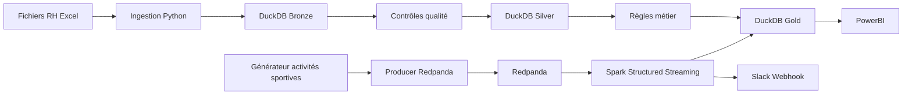
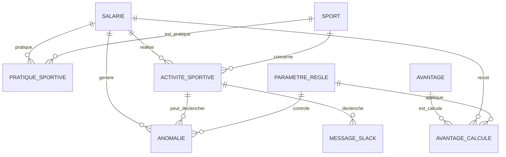

# Sport Data Solution — POC Avantages Sportifs

## 1. Contexte

Sport Data Solution souhaite mettre en place un système permettant de récompenser les salariés ayant une pratique sportive régulière.

Le POC démontre la faisabilité technique d'une chaîne de données complète, depuis la collecte des données RH et sportives jusqu'au calcul des avantages et à la restitution dans PowerBI.

Deux avantages sont étudiés :

- une prime sportive correspondant à 5 % du salaire brut annuel pour les salariés venant au bureau via un mode actif ;
- 5 jours bien-être pour les salariés ayant au moins 15 activités physiques sur l'année.

Le projet permet également une démonstration live :
- injection d'une nouvelle activité sportive ;
- publication d'un message Slack ;
- visualisation dans le reporting final.

---

## 2. Objectifs du projet

- créer une infrastructure de données robuste ;
- générer des données sportives simulées de type Strava ;
- intégrer les données RH ;
- contrôler la qualité des données ;
- calculer les avantages salariés ;
- détecter les anomalies métier ;
- suivre les flux de données ;
- visualiser les résultats dans PowerBI ;
- démontrer un flux live avec Redpanda, Spark et Slack.

---

## 3. Architecture cible



---

## 4. Stack technique

| Besoin | Outil | Justification |
|---|---|---|
| Langage principal | Python | Langage unique pour toute la chaîne |
| Génération des données | Faker | Activités sportives réalistes simulées |
| Streaming | Redpanda | Compatible API Kafka, sans ZooKeeper, léger en local |
| Traitement streaming | Spark Structured Streaming | Standard industrie, scalable en production |
| Stockage analytique | DuckDB | Zéro infra, SQL complet, migrable vers PostgreSQL |
| Contrôles qualité | SQL natif + audit log | Contrôles intégrés dans le pipeline, traçabilité complète |
| Orchestration | Kestra | YAML natif, UI moderne, plus simple qu'Airflow pour un POC |
| Dashboard | PowerBI | Demandé explicitement, rechargement en 1 clic |
| Notifications live | Slack Webhook | Sans OAuth, rapide à intégrer |
| Logs | loguru | Logs horodatés lisibles à chaque étape |
| Conteneurisation | Docker Compose | Déploiement local en 1 commande |

---

## 5. Architecture des données

Le pipeline suit une architecture Medallion (Bronze / Silver / Gold).

### Bronze
Données brutes ingérées telles quelles :
- salariés RH (fichier Excel) ;
- activités sportives simulées ;
- paramètres métier versionnés.

### Silver
Données nettoyées et enrichies :
- contrôles qualité (7 règles automatiques) ;
- normalisation ;
- enrichissement géographique (géocodage domicile-bureau) ;
- quarantaine des activités invalides.

### Gold
Tables analytiques finales :
- KPI financiers (coût primes, coût wellness, coût global) ;
- KPI sportifs (activités par sport, distances, durées) ;
- anomalies détectées ;
- messages Slack envoyés.

---

## 6. Modèle de données

9 entités : SALARIE, SPORT, PRATIQUE_SPORTIVE, ACTIVITE_SPORTIVE, PARAMETRE_REGLE, ANOMALIE, AVANTAGE, AVANTAGE_CALCULE, MESSAGE_SLACK.



---

## 7. Structure du projet

```text
sport-data-solution-poc/
│
├── data/
│   ├── input/          # Fichier RH Excel source
│   ├── bronze/         # Données brutes DuckDB
│   ├── silver/         # Données nettoyées DuckDB
│   ├── gold/           # KPI et résultats DuckDB
│   ├── exports/        # CSV/Parquet pour PowerBI
│   └── cache/          # Cache géocodage
│
├── src/
│   ├── ingestion/      # Chargement données RH
│   ├── generation/     # Génération activités simulées
│   ├── streaming/      # Producer Redpanda + Slack
│   ├── qualite/        # Contrôles qualité
│   ├── metier/         # Règles métier + KPI + géocodage
│   ├── export/         # Export PowerBI
│   └── utils/          # Init entrepôt + rejeu historique
│
├── sql/
│   ├── bronze/
│   ├── silver/
│   └── gold/
│
├── spark/              # Script Spark Structured Streaming
├── kestra/
│   └── flows/          # 4 flows d'orchestration
│
├── docs/               # MCD et documentation
├── tests/
│
├── docker-compose.yml
├── requirements.txt
├── README.md
├── .env.example
└── .gitignore
```

---

## 8. Installation

### Prérequis

- Docker Desktop
- Python 3.10+

### Démarrage

```bash
# 1. Cloner le repo
git clone https://github.com/amalchoukri/sport-data-solution-poc.git
cd sport-data-solution-poc

# 2. Copier et remplir les variables d'environnement
cp .env.example .env

# 3. Lancer les services (Redpanda, Spark, Kestra)
docker compose up -d

# 4. Vérifier que tout est running
docker compose ps
```

### Variables d'environnement (`.env`)

| Variable | Description |
|---|---|
| `REDPANDA_BOOTSTRAP_SERVERS` | Adresse du broker Redpanda (défaut : `localhost:19092`) |
| `REDPANDA_TOPIC_ACTIVITES` | Nom du topic Kafka |
| `SLACK_WEBHOOK_URL` | URL du webhook Slack pour les notifications |
| `GOOGLE_MAPS_API_KEY` | Clé API Google Maps pour le géocodage |
| `ADRESSE_ENTREPRISE` | Adresse du bureau pour le calcul des distances |

---

## 9. Lancer le pipeline

### Via Kestra (recommandé)

Ouvrir l'UI Kestra sur `http://localhost:8080`, importer les flows du dossier `kestra/flows/` et exécuter.

| Flow | Rôle |
|---|---|
| `01_pipeline_complet_sport_data.yml` | Pipeline batch complet de bout en bout |
| `02_rejeu_historique.yml` | Recalcule les KPI avec un nouveau taux de prime |
| `03_streaming_live.yml` | Injecte une activité et envoie la notification Slack |
| `04_initialisation_entrepot.yml` | Réinitialise la base DuckDB |

### Via ligne de commande

```bash
# Initialiser DuckDB
python src/utils/initialiser_entrepot.py

# Charger les données RH
python src/ingestion/ingerer_donnees_rh.py

# Générer les activités sportives
python src/generation/generer_activites_sportives.py

# Contrôler la qualité des données
python src/qualite/controler_qualite_donnees.py

# Géocoder les adresses
python src/metier/geocoder_adresses.py

# Appliquer les règles métier
python src/metier/appliquer_regles_metier.py

# Calculer les KPI
python src/metier/calculer_indicateurs_kpi.py

# Exporter vers PowerBI
python src/export/exporter_donnees_powerbi.py
```

---

## 10. Scripts principaux

| Script | Rôle |
|---|---|
| `initialiser_entrepot.py` | Initialise la base DuckDB (Bronze / Silver / Gold) |
| `ingerer_donnees_rh.py` | Charge les données RH depuis Excel |
| `generer_activites_sportives.py` | Génère les activités sportives simulées |
| `produire_activites_redpanda.py` | Publie un événement dans Redpanda |
| `traitement_streaming_spark.py` | Traite les flux Redpanda avec Spark |
| `envoyer_messages_slack.py` | Envoie les notifications Slack (idempotent) |
| `controler_qualite_donnees.py` | 7 contrôles qualité + quarantaine + audit log |
| `geocoder_adresses.py` | Calcule les distances domicile-bureau avec cache local |
| `appliquer_regles_metier.py` | Calcule l'éligibilité prime et wellness |
| `calculer_indicateurs_kpi.py` | Produit les KPI Gold |
| `exporter_donnees_powerbi.py` | Exporte les tables Gold en CSV/Parquet |
| `rejouer_historique.py` | Recalcule les KPI avec une nouvelle version de paramètres |

---

## 11. Contrôles qualité

7 contrôles automatiques à chaque exécution :

| Contrôle | Action si échec |
|---|---|
| Unicité des salariés | Alerte audit log |
| Salaires positifs | Alerte audit log |
| Activité avec salarié existant | Quarantaine |
| Distance positive | Quarantaine |
| Dates cohérentes (fin > début) | Quarantaine |
| Sport reconnu | Quarantaine |
| Distance cohérente avec le sport | Quarantaine |

Les activités invalides sont isolées dans `silver.quarantaine_activites`. Chaque exécution est tracée dans `bronze.audit_log` avec statut `SUCCES` ou `AVEC_ANOMALIES`.

---

## 12. Règles métier

### Prime sportive — 5 % du salaire brut annuel

Conditions :
- mode de transport déclaré actif (vélo, marche, course) ;
- distance domicile-bureau cohérente : ≤ 15 km à pied, ≤ 25 km à vélo.

### Jours bien-être — 5 jours par an

Condition :
- au moins 15 activités sportives sur les 12 derniers mois glissants.

### Paramètres modifiables

Les seuils (taux de prime, distances max, seuil wellness) sont versionnés dans `silver.parametres_regles`. Le flow `02_rejeu_historique` permet de recalculer l'ensemble des KPI avec de nouveaux paramètres sans modifier le code.

---

## 13. Démonstration live

### Démo A — Changer le taux de prime

1. Kestra → Flow `02_rejeu_historique` → `taux_prime = 0.025`
2. KPI recalculés automatiquement
3. Comparaison v1 (5 %) vs v2 (2,5 %) visible dans PowerBI après actualisation

### Démo B — Injecter une nouvelle activité

1. Kestra → Flow `03_streaming_live` → Execute
2. Redpanda reçoit l'événement
3. Message Slack envoyé dans le channel
4. PowerBI mis à jour après actualisation

---

## 14. Services Docker

| Service | Image | Port | UI |
|---|---|---|---|
| Redpanda | `redpandadata/redpanda:latest` | 19092 | — |
| Redpanda Console | `redpandadata/console:latest` | 8081 | http://localhost:8081 |
| Spark Master | `apache/spark:3.5.0` | 7077 | http://localhost:8082 |
| Spark Worker | `apache/spark:3.5.0` | — | — |
| Kestra | `kestra/kestra:latest` | 8080 | http://localhost:8080 |

---

## 15. Dashboard PowerBI

Le fichier `docs/V1.pbix` contient les pages suivantes :

1. Vue globale — KPI financiers et simulation des scénarios
2. Activités sportives — répartition par sport, distances, durées
3. Impact financier — coûts par version de paramètres
4. Qualité & anomalies — tableau des anomalies avec gravité

Rechargement des données : **Accueil → Actualiser** après chaque exécution du pipeline.

---

## 16. Sécurité et RGPD

- secrets externalisés dans `.env` (non versionné) ;
- messages Slack anonymisés (prénom + initiale du nom) ;
- aucune donnée personnelle dans les logs ;
- cache géocodage local pour limiter les appels API externes ;
- `.env` listé dans `.gitignore`.

---

## 17. Limites du POC

- les activités sportives sont simulées (Faker) — en production, connexion à l'API Strava réelle ;
- DuckDB est adapté au POC local — en production, migration vers PostgreSQL ou un entrepôt cloud ;
- le géocodage utilise Google Maps API avec un cache local pour limiter les coûts.

---

## 18. Évolutions futures

- connexion API Strava réelle ;
- déploiement cloud (AWS / Azure) ;
- monitoring avancé avec Grafana ;
- connexion directe au SIRH (fin du fichier Excel) ;
- authentification renforcée ;
- intégration Data Lake cloud.