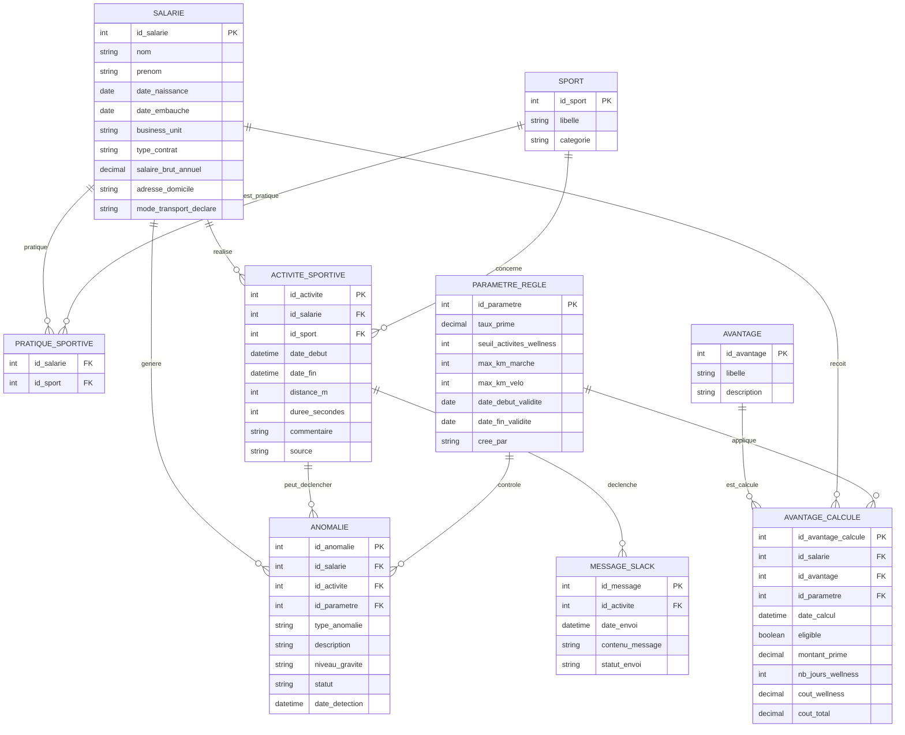

# MCD — POC Avantages Sportifs

## 1. Objectif du modèle

Ce modèle conceptuel de données décrit les principales entités nécessaires au POC Avantages Sportifs.

Il permet de gérer :

- les salariés ;
- les sports pratiqués ;
- les activités sportives simulées ;
- les paramètres de calcul ;
- les avantages proposés ;
- les avantages calculés ;
- les anomalies détectées ;
- les messages Slack envoyés.

L’objectif est de disposer d’une base claire pour construire les tables DuckDB en couches Bronze, Silver et Gold.

---

## 2. Diagramme MCD



---

## 3. Description des entités

### SALARIE

L’entité `SALARIE` représente les collaborateurs de l’entreprise.

Elle contient les informations RH nécessaires au calcul des avantages :

- identité du salarié ;
- date d’embauche ;
- business unit ;
- type de contrat ;
- salaire brut annuel ;
- adresse du domicile ;
- mode de transport déclaré.

Cette entité est centrale car les avantages sont calculés au niveau salarié.

---

### SPORT

L’entité `SPORT` contient le référentiel des sports possibles.

Exemples :

- Course à pied ;
- Vélo ;
- Randonnée ;
- Tennis ;
- Escalade ;
- Yoga.

Elle permet de normaliser les types de sports et d’éviter les valeurs incohérentes.

---

### PRATIQUE_SPORTIVE

L’entité `PRATIQUE_SPORTIVE` permet de gérer la relation plusieurs-à-plusieurs entre les salariés et les sports.

Un salarié peut pratiquer plusieurs sports.

Un sport peut être pratiqué par plusieurs salariés.

---

### ACTIVITE_SPORTIVE

L’entité `ACTIVITE_SPORTIVE` représente une activité sportive réalisée par un salarié.

Elle contient :

- le salarié concerné ;
- le sport pratiqué ;
- la date de début ;
- la date de fin ;
- la distance ;
- la durée ;
- le commentaire ;
- la source de la donnée.

Dans le POC, les activités sont simulées. En production, elles pourraient provenir d’une API comme Strava.

---

### PARAMETRE_REGLE

L’entité `PARAMETRE_REGLE` contient les paramètres utilisés pour les calculs métier.

Exemples :

- taux de prime sportive ;
- seuil minimum d’activités pour les jours bien-être ;
- distance maximale en marche ;
- distance maximale en vélo ;
- période de validité.

Cette entité permet de faire évoluer les règles sans modifier le code.

---

### ANOMALIE

L’entité `ANOMALIE` stocke les incohérences détectées dans les données.

Exemples :

- distance domicile-bureau incohérente ;
- activité invalide ;
- salarié sans activité ;
- mode de transport incompatible ;
- date incohérente.

Elle permet de suivre la qualité des flux et les points à corriger.

---

### AVANTAGE

L’entité `AVANTAGE` décrit les avantages disponibles.

Exemples :

- prime sportive ;
- jours bien-être ;
- réduction abonnement sportif.

Elle permet de séparer la définition d’un avantage de son calcul pour chaque salarié.

---

### AVANTAGE_CALCULE

L’entité `AVANTAGE_CALCULE` contient le résultat des calculs d’avantages pour chaque salarié.

Elle permet de stocker :

- l’éligibilité ;
- le montant de la prime ;
- le nombre de jours bien-être ;
- le coût des jours bien-être ;
- le coût total.

Cette entité sert directement à construire les KPI financiers dans PowerBI.

---

### MESSAGE_SLACK

L’entité `MESSAGE_SLACK` trace les messages envoyés dans Slack.

Elle contient :

- l’activité ayant déclenché le message ;
- le contenu du message ;
- la date d’envoi ;
- le statut d’envoi.

Elle permet de vérifier que la démonstration live fonctionne correctement.

---

## 4. Règles métier principales

### Règle 1 — Prime sportive

Un salarié peut être éligible à la prime sportive si :

- son mode de transport déclaré est actif ;
- la distance domicile-bureau est cohérente avec ce mode de transport.

Règles de distance :

- marche / running : maximum 15 km ;
- vélo / trottinette / autres modes actifs : maximum 25 km.

Montant de la prime :

```text
prime sportive = salaire brut annuel × taux de prime
```

Par défaut :

```text
taux de prime = 5 %
```

---

### Règle 2 — Jours bien-être

Un salarié peut être éligible aux jours bien-être si :

- il a réalisé au moins 15 activités sportives sur les 12 derniers mois.

Nombre de jours accordés :

```text
5 jours bien-être
```

---

### Règle 3 — Rejeu des paramètres

Les paramètres métier doivent pouvoir évoluer.

Exemples :

- taux de prime passant de 5 % à 7 % ;
- seuil d’activités passant de 15 à 20 ;
- modification des seuils de distance.

Le modèle prévoit donc une entité `PARAMETRE_REGLE` avec une période de validité.

Cela permet de recalculer les KPI avec une nouvelle version des règles.

---

### Règle 4 — Détection des anomalies

Le système doit détecter les anomalies principales.

Exemples :

- salarié avec mode actif mais distance trop élevée ;
- salarié sans activité sportive ;
- activité avec distance négative ;
- activité sans salarié connu ;
- date de fin antérieure à la date de début.

Ces anomalies alimentent la table `ANOMALIE` et les KPI de qualité.

---

### Règle 5 — Notification Slack

Lorsqu’une nouvelle activité sportive est injectée dans le flux live :

1. l’activité est publiée dans Redpanda ;
2. Spark traite l’événement ;
3. un message Slack est généré ;
4. le message est tracé dans `MESSAGE_SLACK`.

Les messages Slack doivent être anonymisés.

Exemple :

```text
Bravo Amal C. ! Tu viens de courir 10,8 km en 46 min !
```

---

## 5. Utilisation du MCD dans le projet

Ce MCD sert de base pour construire :

- les scripts SQL DuckDB ;
- les tables Bronze, Silver et Gold ;
- les traitements métier ;
- les KPI PowerBI ;
- la démonstration live Slack.

Il garantit que le projet reste cohérent entre la conception, le code et la restitution finale.
